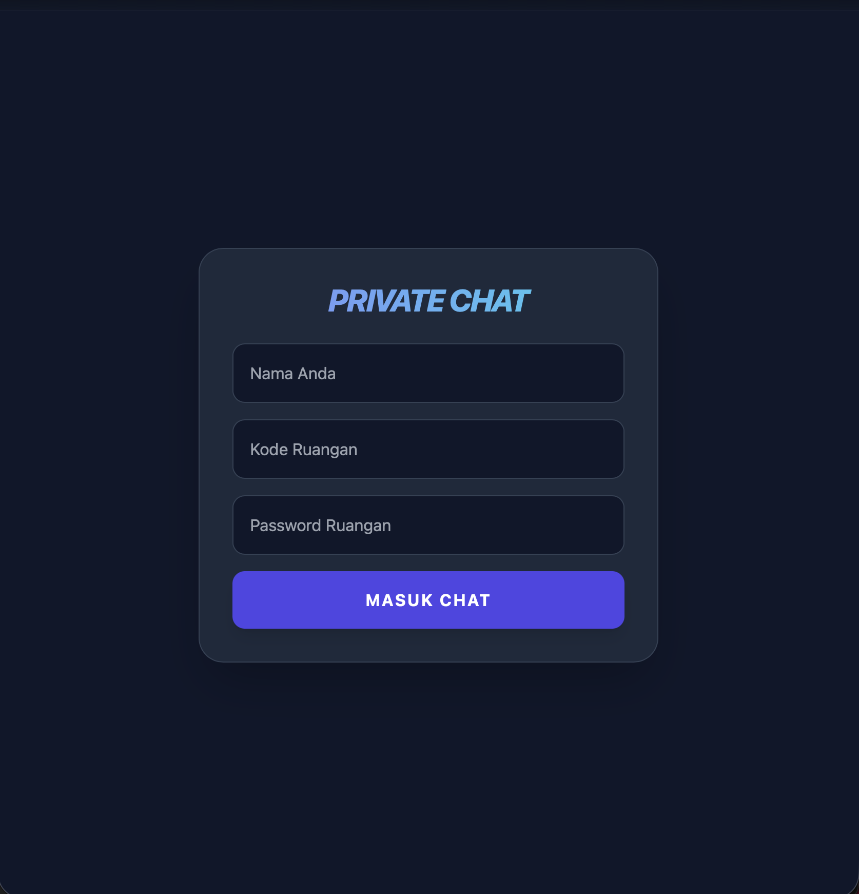

# 💬 Private Chats


[](https://opensource.org/licenses/MIT)

**Private Chats** is a real-time messaging application designed for secure and private communication. Built with performance and privacy in mind, this project allows users to create private rooms and exchange messages instantly.

## 🚀 Features

* **Real-time Messaging**: Instant message delivery using [Socket.io / WebSocket].
* **Private Rooms**: Create and join secure chat rooms with unique IDs.
* **User Authentication**: Secure login and registration system.
* **Responsive Design**: Works seamlessly on desktop and mobile devices.
* **Message History**: [Optional: Messages are stored securely in the database].
* **Online Status**: See who is currently active.

## 🛠️ Tech Stack

**Frontend:**
* [e.g., React.js / Vue.js / HTML5 & CSS3]
* [e.g., Tailwind CSS / Bootstrap]

**Backend:**
* [e.g., Node.js]
* [e.g., Express.js]
* [e.g., Socket.io]

**Database:**
* (None)

## 📸 Screenshots



## ⚙️ Installation & Setup

Follow these steps to run the project locally.

### Prerequisites

* Node.js (v14 or higher)
* npm or yarn
* [Database installed/configured if applicable]

### Steps

1.  **Clone the repository**
    ```bash
    git clone [https://github.com/stnrdyha/private-chats.git](https://github.com/stnrdyha/private-chats.git)
    cd private-chats
    ```

2.  **Install dependencies**
    ```bash
    # Install backend dependencies
    npm install

    # If you have a separate client folder:
    cd client
    npm install
    ```

3.  **Environment Variables**
    Create a `.env` file in the root directory and add the following:
    ```env
    PORT=5000
    MONGO_URI=your_database_connection_string
    JWT_SECRET=your_jwt_secret
    ```

4.  **Run the application**
    ```bash
    # Run in development mode
    npm run dev
    ```

5.  **Access the App**
    Open your browser and navigate to `http://localhost:5000` (or the port you specified).

## 🤝 Contributing

Contributions are always welcome!

1.  Fork the repository.
2.  Create a new branch (`git checkout -b feature/AmazingFeature`).
3.  Commit your changes (`git commit -m 'Add some AmazingFeature'`).
4.  Push to the branch (`git push origin feature/AmazingFeature`).
5.  Open a Pull Request.

## 📝 License

This project is licensed under the [MIT] License - see the [LICENSE](LICENSE) file for details.

## 👤 Author

* *Initial work* - [stnrdyha](https://github.com/stnrdyha)

---

<p align="center">
  Built with ❤️ by <a href="https://github.com/stnrdyha">stnrdyha</a>
